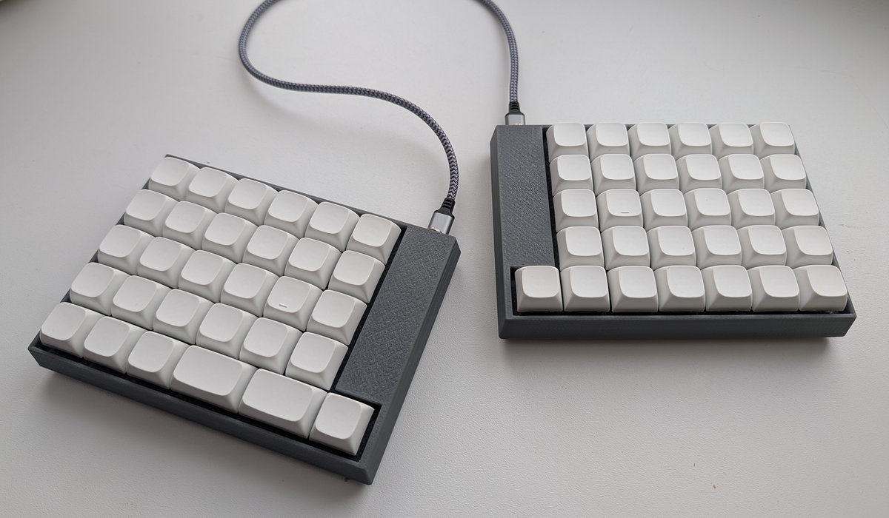

# Cornedeon Ortho 61 Keyboard
## Based on [Cornedeon Ortho](https://github.com/alko-kbd/cornedeon_ortho_60)

5x7 ortho matrix with digital row and additional keys.

Keyboard Maintainer: [alko](https://github.com/alko-kbd/cornedeon_ortho_61) [alko@cornedeon.ru](mailto:alko@cornedeon.ru)

Web Site: [cornedeon.ru](https://cornedeon.ru)

Hardware Supported: Handwired

### Build

Install Vial build environment.

Copy all files to directory: vial-qmk/keyboards/alko/cornedeon_ortho_61/

qmk compile -kb alko/cornedeon_ortho_61 -km vial
